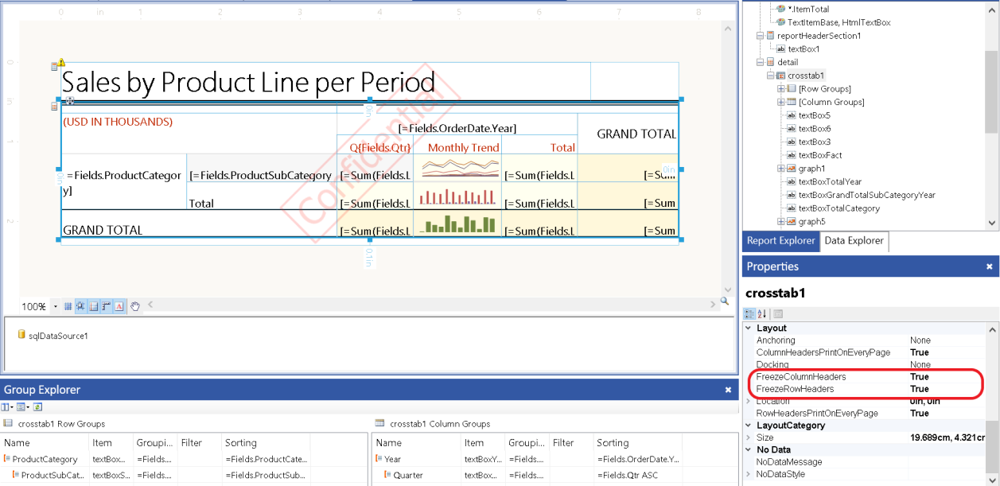

# Table Header Freezing

Freezing the table headers prevents the row and column headers of a table from scrolling out of view while examining extensive data of a report document.
        All HTML5-based report viewers provide support for freezing in Interactive rendering mode and all report designers provide support for enabling the functionality.
        Header freezing is supported also in Web Report Designer Preview mode.
      

## Settings in the Report Designers

Each table or crosstab has [FreezeColumnHeaders](/reporting/api/Telerik.Reporting.Table#Telerik_Reporting_Table_FreezeColumnHeaders) and
          [FreezeRowHeaders](/reporting/api/Telerik.Reporting.Table#Telerik_Reporting_Table_FreezeRowHeaders) properties:
        

* FreezeColumnHeaders keeps the column headers visible while scrolling vertically.
            

* FreezeRowHeaders keeps the row headers visible while scrolling horizontally.
            

To keep the table headers visible while scrolling:
        

1. Select a table/crosstab component from the __Explorer tab__, or click the corner handle of a table data region, and then
              go to its Properties pane on the right.
            

1. Under __Layout__, select which headers (row, column or both) should remain visible while scrolling.
              
  

## Settings in the Report Viewers

The HTML5 Viewer automatically applies the freeze functionality in __[Interactive mode]()__          when it is enabled from the designers.
          The picture below shows a report with frozen row and column headers:
          
  

## Behaviour

If the cells of the table headers have no or transparent background color, in order to preserve readability, their parent's background color
          is applied to them while scrolling.
        

When *PageBreak* is set to a group, FreezeRowHeaders and FreezeColumnHeaders will work only if
          *RowHeadersPrintOnEveryPage* and *ColumnHeadersPrintOnEveryPage*, respectively, are also set to true.
          Otherwise, the headers will be frozen only on the first page.
        

Even though the List report item has FreezeRowHeaders and FreezeColumnHeaders in the Properties pane, it doesn't have any headers
          and therefore, this feature is not applicable to it.
        

# See Also

 * [Interactive vs. Print Layout]()

 * [Understanding Crosstab Areas]()

 * [Understanding Pagination]()

 * [HTML Rendering Design Considerations]()
