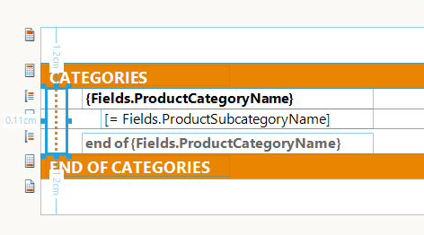

# Cross-section Item

The Cross-section Item is used to display a graphical primitive (vertical line or rectangle) across one or more report sections.
        It is often used in scenarios where the parts of the reports - usually group sections - needs to be visually distinguished from each other.
        The following screenshot shows how the Cross-section item looks like in the Standalone Report Designer:
        
  

You can use shapes to create visual effects within a report. You can set display and other properties to this item by
        using the Properties pane.
      

## Properties

The properties that define the behavior of the Cross-section item are listed below:

* __BeginSection__ - this property defines the report section from which the cross-section item will start. It can be any instance of
              T:Telerik.Reporting.ReportSectionBase class: PageHeader, ReportHeader or GroupHeader.
            

* __BeginMargin__ - this property defines the offset from the top of the __BeginSection__ measured in
              T:Telerik.Reporting.Drawing.Units.
              The offset will be preserved if the __BeginSection__ changes its size at runtime.
            

* __EndSection__ - this property defines the report section at which the cross-section item will end. It also can be any instance of
              T:Telerik.Reporting.ReportSectionBase class: PageFooter, ReportFooter or GroupFooter.
            

* __EndMargin__ - this property defines the offset from the bottom of the __EndSection__ measured in
              T:Telerik.Reporting.Drawing.Units.
              The offset will be preserved if the __EndSection__ changes its size at runtime.
            

The properties that define the appearance of the Cross-section item are listed below:
        

* __Type__ - this property defines the type graphical primitive rendered by the cross-section item.
              It can be *Line* or *Rectangle*. The default value is *Line*.
            

* __Position__ - this property defines whether the cross-section item will be rendered under the rest of the report items or on top of them.
              It can be set to *Behind* or *Front*. The default value is *Behind*.
            

The P:Telerik.Reporting.ReportItem.Location and
          P:Telerik.Reporting.ReportItem.Size properties are calculated based on the
          *BeginSection*, *BeginMargin*, *EndSection* and *EndMargin* properties.
          Changing the values of the P:Telerik.Reporting.ReportItem.Location- or
          P:Telerik.Reporting.ReportItem.Size-related property like
          P:Telerik.Reporting.ReportItem.Top,
          P:Telerik.Reporting.ReportItem.Left,
          P:Telerik.Reporting.ReportItem.Width or
          P:Telerik.Reporting.ReportItem.Height will recalculate the values of
          *BeginSection*, *BeginMargin*, *EndSection* and *EndMargin* properties.
        

In most scenarios the *Begin-* and *End* sections would have matching types and hierarchy levels, i.e. 
          *ReportHeader - ReportFooter, GroupHeader - GroupFooter*. Choosing mismatching sections can produce unexpected rendering results.
        

## Instantiation and Design-Time Support

Since the Cross-section item can refer to more than one report sections, its parent is the T:Telerik.Reporting.Report item.
          Hence the Cross-section item can be dragged from the designer's toolbox onto the designer surface without selecting any report section first.
          When the Cross-section item is moved or resized on the report designer surface, its Begin- and End-related properties are automatically calculated based on its current location and size and displayed in the Properties window.
        

Selecting a Cross-section item can be done through the [Report Explorer]() tool window or by clicking on the graphical primitive the item displays.
          If its *Type* is set to __Line__, the item's selectable area is on both sides of the displayed vertical line and spans to at least 6 pixels.
          If the item's *Type* is set to __Rectangle__, the selectable area can be any of its sides, again spanning to at least 6 pixels.
        

>note The Cross-section item has complete design-time support in Standalone Report Designer and Visual Studio Report Designer. The Web Report Designer currently provides basic designing capabilities and some of the properties of the Cross-section item cannot be edited through the dedicated property editors.

The Cross-section item can be added programmatically to a report with the following code:
        

	

	

The order of assignments is important, because settings any *Location*- or *Size*-related properties
          would iterate through the sections of the report, determining which of its sections should be assigned to the *BeginSection* and *EndSection* properties,
          and also set the corresponding margins. That's why the item needs to be added to the Report's Items collection first and then assign its section-related properties.
        

## Processing and Rendering

The Cross-section item is rendered per each page based on the occurrences of the report sections that match its *Begin-* and *End* section settings.
          If the *EndSection* is positioned on a following page or report column, the Cross-section item will generate a graphical primitive that spans to the end of the usable page area
          and continues from the top of the next page.
        

The Cross-section item uses the report's data context and cannot be evaluated against detail or group data.
          The processing engine produces a single instance per each Cross-section item in the report definition, therefore its style or visibility cannot be changed based on data fields.
        

The Cross-section item is designed to aid the production of form-type reports and it tries to preserve its location and size set at design-time.
          It will not grow when the report or any of its report section grows horizontally, therefore it won't be rendered on a page, generated as a result of such horizontal paging. 
          However, in a multi-column report the Cross-section item will be generated per each report column shown on a page.          
        

The Cross-section item is not supported in all rendering extensions. Please check the corresponding "Design Considerations" article to ensure if it is supported for a given rendering extension.
        

# See Also

 * [Understanding Pagination]()
