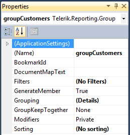

# How to Create Group Headers and Footers (obsolete)

Each Report Group has a Group Header and a Group Footer section associated with it. How to create a Report Group is explained in [How-To: Add groups to Report]() article.

## Group Header/Footer Specific Properties

* __PrintOnEveryPage__: Set to __True__ to repeat the group header at the top of each page if the details of the group extend across multiple pages.
				

## Report Group Properties

To set the following group properties you have to select a group from the [Group Explorer]()

* __Filters: __This property determines which groups will display. This level of filtering occurs before filtering for the report as a whole occurs. The filters for the group are applied to the grouping data, not the report data itself. Filter data for the group using the __Filters__ property ellipses to invoke the [Edit Filter Dialog](). See [Filtering Report Data]() for more information.
			

* __GroupKeepTogether__: Set to __FirstDetail__ to ensure that the group header and the first detail record are printed on the same page of output, or __All__ to ensure that the entire group is printed on the same page of output. If there is not enough space on the current page, then rendering will skip to the top of the next page.
			

* __Grouping__: The grouping property controls how groups of data are broken out in the report. Click the ellipsis for this property to invoke the [Edit Grouping Dialog](). This dialog allows you to specify grouping criteria that determine where the grouping level breaks occur. __Note__: It is also possible to have groups with no grouping criteria.

* __Sorting__: This property controls the sorting order for the grouping data, not the report data. This level of sorting occurs before the sorting for the report as a whole. For example, Click the ellipsis button for this property to open the __Edit Sorting__ dialog. Click __Add__ to add a new sort expression. For each SortExpression, set the __FieldName__ property to the name of the field by which this group should sort records, and select either __Ascending__ or a __Descending__ sort order.
			  
   
      

# See Also
[GroupHeaderSection](/reporting/api/Telerik.Reporting.GroupHeaderSection)[GroupFooterSection](/reporting/api/Telerik.Reporting.GroupFooterSection)[Group](/reporting/api/Telerik.Reporting.Group)
