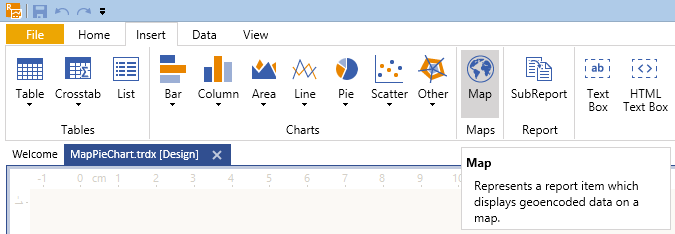
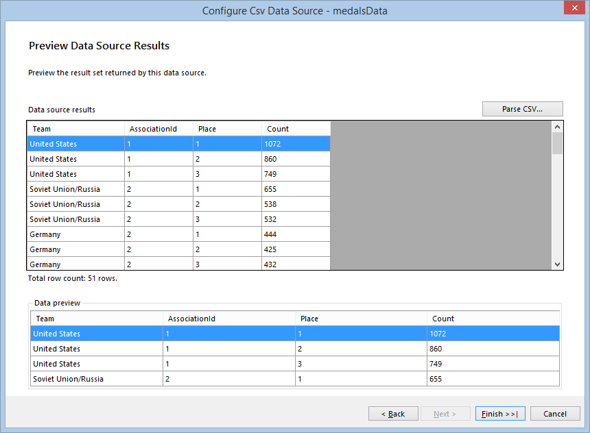
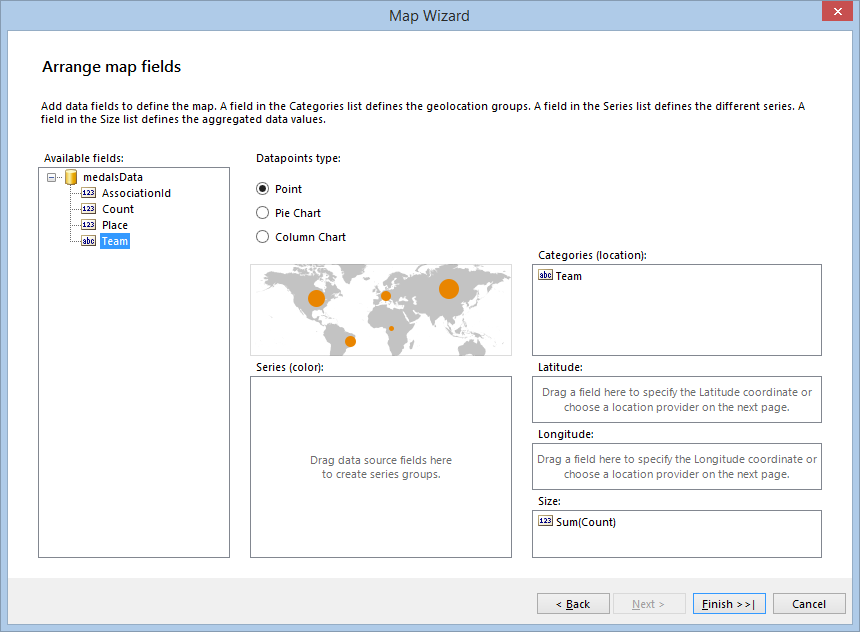
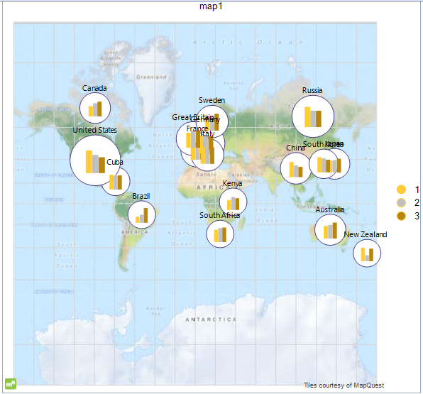
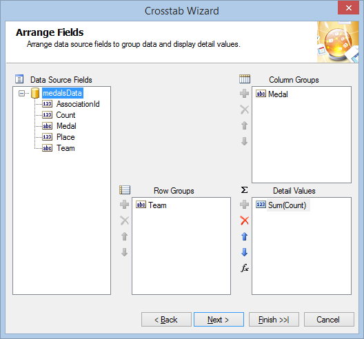

# How to Create a Map with BarChart series using CSV data source

In this how-to article we will show you how to create a Map which will present the
        [countries with the most medals won in Olympic Games](http://en.wikipedia.org/wiki/All-time_Olympic_Games_medal_table)

        divided by their continental
        [Association of National Olympic Committees](http://www.olympic.org/ioc-governance-national-olympic-committees).
        We will also add some interactivity to the report, giving the user the option to choose which countries to be displayed
        on the map, highlighting the currently selected country and displaying an additional chart with
        detailed information about it. We will be using the [Standalone Report Designer]()
        to demonstrate how such a complex report can be done without writing any code.
      

>important This article assumes that you have obtained a valid  __Location Provider key__  to authenticate your geocoding requests.          If you don't want to use a location provider, you need to provide the geographical coordinates of your points yourself and setup the MapSeries accordingly.          For more information please take a look at the [Location Providers]() article.        

Start the Map Wizard:

* If you create a new report, select the __Map Wizard__ icon from the __Available Templates__ page.
                  
  

* If you want to add the Map item to an existing report, you have to select the __Map__ item
                  from the __Insert__ menu.
                  This will bring up the __Map Wizard__ which will guide you through the creation process.
                  
  

Add new
              [CSV Data Source]()
              and name it __medalsData__. This data source will hold the information about the
              countries, the ID of their respective olympic association, which place and how many times they have occupied it.
            

1. Download the
                  [MedalsData.csv file](http://blogs.telerik.com/docs/default-source/reporting/medalsdata.csv?sfvrsn=2)
                  , save it locally and insert its path into the *Select a file to import* textbox.
                  The information in this file is an example data set that shows how many times a national olympic team had occupied a first, a second
                  or a third place in the Olympic Games. It also has a relation with the Association of National Olympic Committees table
                  that we will build later.
                

1. Press __Next__ until you get to the __CSV Headers__ page.
                  Note that the CSV file has headers, so you should check the *The CSV has headers* checkbox.
                

1. On the __Map columns to type__ page set the type of `AssociationId, Place` and
                  `Count` columns to __Integer__.
                

1. When you click __Parse CSV...__ on the next page, you should see the result of the parsed file, which should look
                  like this:
                  
  Click __Finish__ when you are ready.
                

In the *Available data sources* list you should see the datasource you've already created.
              Select it and click __Next__.
            

In the next page you have to select the fields which will be used to build the map charts.
            

>note Since the map will use a Location Provider, there is no need to provide the  __Latitude__  and  __Longitude__  coordinates by yourself, so you can                left these boxes empty and just define a location group, which will set the geocoding string.              

* Select the __Column Chart__ radiobutton from the *Datapoints type* box.
                

* Select the __Place__ field and drag it to the *Series (color)* box.
                

* Select the __Team__ field and drag it to *Categories (location)* box.
                

* Select the __Count__ field and drag it to *Size* box, where it will be transformed to
                  __Sum(Count)__.
                

Your __Arrange map fields__ page should look like the one shown below:
              
  

Once the mandatory fields are set up, the __Next__ button will get enabled and you can go to the next page.
            

On the __Choose a location provider__ page you have to select the location provider that will be used to geocode
              the __State__ field that was dragged in the *Categories (location)* box on the previous page.
              Currently the supported providers are
              [MapQuestOpenAPILocationProvider](/reporting/api/Telerik.Reporting.MapQuestOpenAPILocationProvider)
              ,
              [MapQuestLocationProvider](/reporting/api/Telerik.Reporting.MapQuestLocationProvider)
              and
              [BingLocationProvider](/reporting/api/Telerik.Reporting.BingLocationProvider).
              They both require a valid client token (key) to authenticate the geocoding requests that will be sent from the Map item.
              Once you have obtained the key, you should paste it in the *Client token* box, as shown below:
              
  

When you click __Finish__, the Wizard will create the definition of the Map item, show it in the designer
              and will start to request the geocode and tiles information from the providers asynchronously. Initially it will take a few seconds to fetch
              all the data from the geocoding service, but the following requests should be executed faster. The tiles, needed to prepare the map background,
              will be displayed as they arrive, but the map will stay responsive and you can examine and change its definition.
              When finished, your map should look like this:
              
  

Now we will add a
              [PointMapSeries](/reporting/api/Telerik.Reporting.PointMapSeries)
              that will display a circle around each column chart. The circle size will be relevant to the
              whole number of medals each team has won.
            

The easiest way to add a series to the already created __Map__ or __Graph__ is to select it
              and then start the respective Wizard. In this case you should start the MapWizard again by clicking the Map toolbar icon and on the
              __Arrange map fields__ page perform the following steps:
            

* Select the __Point__ radiobutton from the *Datapoints type* box.
                

* Select the __Team__ field and drag it to *Categories (location)* box.
                

* Select the __Count__ field and drag it to *Size* box, where it will be transformed to
                  __Sum(Count)__.
                

Your __Arrange map fields__ page should look like the one shown below:
              
  

When you click the __Finish__ button, the map will display the two series together, rendered in the
              order they have been created. That's why you will see the column charts being overlapped by the circles.
            

The map needs some more setup and styling in order to make it look good. Select the Map item, click on the
              __Series__ item in the Property grid and perform the following steps in the opened
              __MapSeries Collection Editor__:
            

* In the left pane (__Members:__) select the __pointMapSeries1__ item and move it up using 
                  the arrow buttons. This will cause the circles to be displayed as a background of the column charts.
                

* Since the PointMapSeries will use the same grouping as the ColumnMapSeries, you should set its GeoLocationGroup to
                  __teamGroup__ and its SeriesGroup to __seriesGroup__, which were created along with the
                  ColumnMapSeries.
                

* As you have the __pointMapSeries1__ selected, set its
                  [DataPointStyle](/reporting/api/Telerik.Reporting.GraphSeriesBase#collapsible-Telerik_Reporting_GraphSeriesBase_DataPointStyle)
                  .
                  [BackgroundColor](/reporting/api/Telerik.Reporting.Drawing.Style#collapsible-Telerik_Reporting_Drawing_Style_BackgroundColor)
                  to __White__ and the
                  [LineColor](/reporting/api/Telerik.Reporting.Drawing.Style#collapsible-Telerik_Reporting_Drawing_Style_LineColor)
                  to a color of your choice. In the example report is used the __DarkSlateBlue__
                  color from the __Web__ palette.
                

* Set the
                  [DataPointLabel](/reporting/api/Telerik.Reporting.GraphSeriesBase#collapsible-Telerik_Reporting_GraphSeriesBase_DataPointLabel)
                  expression to `=Fields.Team` to display the name of the national team above the point.
                

* Set the
                  [DataPointLabelStyle](/reporting/api/Telerik.Reporting.GraphSeriesBase#collapsible-Telerik_Reporting_GraphSeriesBase_DataPointLabelStyle).
                  [Visible](/reporting/api/Telerik.Reporting.Drawing.Style#collapsible-Telerik_Reporting_Drawing_Style_Visible)
                  property to __True__.
                

* Select the __columnMapSeries1__ item from the __Members:__ pane and set its
                  [MarkerMinSize](/reporting/api/Telerik.Reporting.PointMapSeries#collapsible-Telerik_Reporting_PointMapSeries_MarkerMinSize) to __6mm__ and
                  [MarkerMaxSize](/reporting/api/Telerik.Reporting.PointMapSeries#collapsible-Telerik_Reporting_PointMapSeries_MarkerMaxSize) to __10mm__.
                

* In order to match the column series colors with the real world medal colors, you need to define a custom ColorPalette.
                  The process is explained [here]()
                  and the colors used for this example are shown on the following screenshot:
                  
  

* If you wish, you can change the map size, adjust the fonts properties and try various styling, but finally your map should look like this:
                  
  

As you may have noticed, the information about the occupied places is present in the CSV file as integer numbers, that's why the
              legend displays it this way. But the report will look better if the information about the places is displayed with medal names - 
              __Gold__, __Silver__ and __Bronze__. 
              This can be achieved using an expression for the
              [LegendItem](/reporting/api/Telerik.Reporting.LegendItem).
              [Value](/reporting/api/Telerik.Reporting.LegendItem#collapsible-Telerik_Reporting_LegendItem_Value), but we will use a
              [Calculated Field]()
              , added to the CSV Data Source. The benefit of this approach is that we can use the calculated field as any other field, without having to
              use an expression every time we need to address it.
            

Select the __medalsData__ data source, add a calculated field named __Medal__ 
              of type `String` to it and set its expression to:
            

	
              =IIF(Fields.Place = 1, 'Gold', IIF(Fields.Place = 2, 'Silver', IIF(Fields.Place = 3, 'Bronze', 'none')))
            

Now you can set the __columnMapSeries' __[LegendItem](/reporting/api/Telerik.Reporting.LegendItem).[Value](/reporting/api/Telerik.Reporting.LegendItem#collapsible-Telerik_Reporting_LegendItem_Value) expression to
              `=Fields.Medal` and style the legend by your choice.
            

In case we want to reduce the amount of displayed information on the map, one of the best options is to use
              [Report Parameters]()
              and  apply
              [Filtering](). In this case the filtering will be based on the 
              __AssociationId__ field.
            

In order to display the meaningful names of the olympic associations, we will add another CSV Data Source, which has a relation with the
              current data source's `AssociationId` field and will be used only for displaying the report parameters.
            

* Add a new CSV Data Source, select the tab *Enter CSV as text* and paste the following text in the box:
                

	
                  Id,Name
                  1,Pan-American Sports Organization
                  2,European Olympic Committees
                  3,Olympic Council of Asia
                  4,Oceania National Olympic Committees
                  5,Association of National Olympic Committees of Africa
                

* Check the *The CSV has headers* box on the __CSV Headers__ page.
                

* On the __Map columns to type__ page set the type of `Id` column to
                  __Integer__.
                

* When you click __Parse CSV...__ on the next page, you should see the result of the parsed file.
                  Click __Finish__ when you are ready and name the dataSource __associationsData__
                  when the Wizard closes.
                

* Add new report parameter named __associationParam__ and set its properties as shown at the following screenshot:
                  
  By default the parameter will be set to the association with `Id = 1`, which means that the report
                  initially will show all the teams that are members of __Pan-American Sports Organization__. However, because it is a multivalue
                  parameter, you can add all the Association IDs in its __Value__ property.
                

* Select the Map item and add a Filter Rule, that will filter out the teams with an AssociationId different than the ones, selected in the
                  __associationParam__. Set the __
                    Expression__ to `=Fields.AssociationId`,
                  the __Operator__ to `In` and the __Value__ to
                  `=Parameters.associationParam.Value`.
                When you close the Filter Rules dialog, the designer gets updated and the map should show only the teams
                  from the Pan-American Sports Organization. If you preview the report, you will be able to change the map extent
                  only by selecting different combinations of parameter values.
                

Since the column charts on the map are not suitable to display any labels on them, we will add an additional CrossTab,
              which will show the number of medals and calculate their amount for each national team.
            

* Start the Crosstab Wizard and choose the __medalsData__ data source on its 
                  __Choose a Data Source__ page.
                

* Select the __Medal__ field and drag it to the *Column Groups* box.
                

* Select the __Team__ field and drag it to *Row Groups* box.
                

* Select the __Count__ field and drag it to *Detail Values* box, where it will be transformed to
                  __Sum(Count)__.
                Your __Arrange fields__ page should look like the one shown below:
                  
  

* On the __Choose Layout__ page select *Blocked layout, subtotals below* option
                  and select __Finish__ if you do not need to choose from any predefined stylings.
                

* Once the Crosstab Wizard is closed, your crosstab is done, but now it needs to be filtered the same way as the Map item. Apply the
                  same filter rule as you did in the previous step (`=Fields.AssociationId In =Parameters.associationParam.Value`).
                

* If you want to apply a different color for any of the medals columns, you have to set up three
                  [ConditionalFormatting Rules]() to the textbox with the value 
                  *=Fields.Medal*
                  , as shown below:
                  
  

* In order to have the information in your crosstab sorted properly, you can set `=Sum(Fields.Count) Desc`
                  as a sorting for the row group and `=Fields.Place Asc` as a sorting for the column group.
                

* You can change the table styling by your choice, but finally when you preview the report, the crosstab should look like the one below:
                  
  

In this step we will add some interactivity to our report, allowing the user to select a national team from the crosstab and changing
              the map extent according to its selection. The drill-through action will use an invisible report parameter which will store
              the selected team name and utilize it in conditional formattings and filterings.
            

* Add new report parameter named __teamParam__. Set its __AllowNull__ property
                  to __True__ and leave the other properties as set by its default constructor.
                

* If you haven't saved your report so far, save it now.
                  Select the crosstab's textbox that displays the team name and add a __Navigate to Report__ action,
                  as explained [here]().
                Click on __Select a Report Source__ button, select *URL or File* option and
                  from the *Select a file or enter a valid URL:* drop-down list click the
                  __< Select a file >__ option.
                

* From the __Open file__ dialog select the report you're currently working on. This will cause the report to call itself
                  every time this action is performed.
                

* Click on __Edit Parameters...__ button, which will bring up the Edit Parameters dialog. When you click on
                  *New* toolbar button, the two report parameters - __associationParam__ and
                  __teamParam__ - should be loaded in the *Parameter Name* drop-down list.
                

* Select `associationParam` from the *Parameter Name* drop-down list and choose `=Parameters.associationParam.Value`
                  for *Parameter Value*.
                Select `teamParam` from the *Parameter Name* drop-down list and add the following expression as *Parameter Value*:
                  `=ReportItem.Text`This setup means that on every report call the value of the __associationParam__ will be preserved and
                  the __teamParam__ value will be set from the textbox that initiated the action.
                

* To make the currently selected crosstab row more distinctive, we can apply a conditional formatting to it.
                  Select the whole row, clicking on its header. This will select its three cells. Add new conditional formatting rule and set
                  its expression to `=Fields.Team` and its value to `=Parameters.teamParam.Value`.
                  Set an appropriate color as a style background to denote the selected state of the row.
                

* We can apply conditional formatting to the map series as well, outlining the currently selected national team so it would be easier to
                  find it among the data points on the map. Select the __PointMapSeries__ and set a new
                  [DataPointConditionalFormatting](/reporting/api/Telerik.Reporting.GraphSeriesBase#collapsible-Telerik_Reporting_GraphSeriesBase_DataPointConditionalFormatting)
                  rule, as shown here:
                  
  

Finally we will add a small Graph showing a
              [Column Chart]()
              that will be used to display the amount of medals won by each team.
            

* Start the Graph Wizard by selecting __Column__, __Clustered Column__ from the 
                  __Insert__ toolbar of the Standalone Report Designer.
                

* Select __medalsData__ as a Graph's data source.
                

* On the next page select the __Medal__ field and drag it to the *Series* box.
                Select the __Count__ field and drag it to *Values* box, where it will be transformed to
                  __Sum(Count)__.
                Click __Finish__ when you are ready.
                

* Since the graph's purpose is to show the currently selected team's medals, you have to apply filtering by __Team__
                  to it: `=Fields.Team = =Parameters.teamParam.Value`

* In order to make it look the same way as the map's column charts, you have to set the __Sorting__ of the
                  first member of the graph's series groups to
                  `=Fields.Place ASC` and apply the same ColorPalette you have defined in step 8 to the Graph item.
                Additionally you can make the graph axes invisible, set the Y axis __Minumum__ to 0 and change the styling properties of its data points and data point labels.
                

When you are finished, you can preview your report and it should look similar to this one:
              
  

In this example we demonstrated some of the newest features of Telerik Reporting along with a couple of advanced techniques that can be used
            to make your reports more dynamic and more interactive, and all that without writing a single line of code.
          

You can download this example report as a __.trdx__ report definition from the following link:
            [How to: Create а map with ColumnChart series using CSV data source.](http://blogs.telerik.com/docs/default-source/reporting/olympicmedalsbynationalteams.trdx?sfvrsn=2)

 * [How to Setup a Map Using the Map Wizard]()

 * [Map Overview]()

 * [Map Structure]()

 * [Location Providers]()
