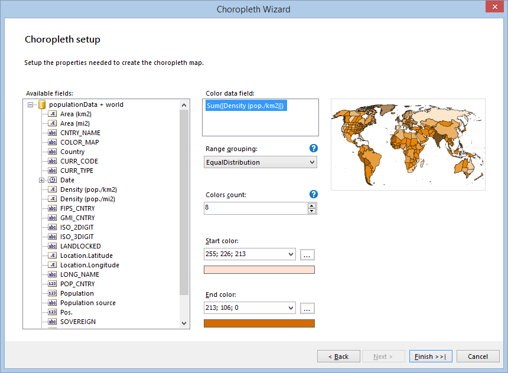
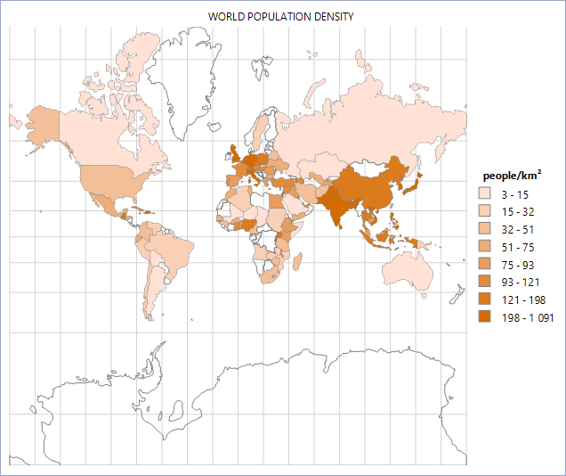

# How to Setup a Choropleth Using the Map Wizard

In this how-to article we will show you how to use the [Standalone Report Designer]() to
        create a Choropleth map. The map will show the world population for each country, coloring its area depending on the population density value.
        We will use a [CSV Data Source]() for the analytical data and a
        [ESRI Shapefile](http://en.wikipedia.org/wiki/Shapefile)
        for the spatial data. The analytical data is obtained from the following Wikipedia article:
        [List of sovereign states and dependent territories by population density](http://en.wikipedia.org/wiki/List_of_sovereign_states_and_dependent_territories_by_population_density).

      
        Creating a simple choropleth map using CSV data source and a Shapefile
      

Start the Map Wizard:

* If you create a new report, select the __Choropleth Wizard__ icon from the __Available Templates__ page.
                  
  

* If you want to add the Map item to an existing report, you have to select the __Choropleth__ item
                  from the __Insert__ menu.
                  This will bring up the __Choropleth Wizard__ which will guide you through the creation process.
                

Add new
              [CSV Data Source]()
              and name it __populationData__. This data source will hold the information about the
              countries, their area, population and density along with some additional data.
            

* Although you can copy the data directly from the Wikipedia page mentioned above, for your convenience we have prepared a CSV file
                  that you can pass to the CSV data source.
                Download the
                  [PopulationData.zip](https://github.com/telerik/reporting-docs/raw/master/knowledge-base/resources/PopulationDensity.zip)
                  file, save it locally and extract its contents in a folder of choice. Navigate to that folder and locate the __PopulationDensity.csv__ file.
                  Back in the wizard, insert the path to the CSV file into the *Select a file to import* textbox or paste its contents in the
                  __Enter CSV as text__ tab.
                

* The file uses semicolon (__;__) as a separator, but the comma (__,__) is used as thousands separator.
                  Thus tick the semicolon checkbox and untick the comma checkbox on the
                  __Configure the separators__ page.
                

* Press __Next__ until you get to the __CSV Headers__ page.
                  Note that the CSV file has headers, so you should check the *The CSV has headers* checkbox.
                

* On the __Map columns to type__ page set the column types to match the actual data they represent, as shown below.
                  
  

* When you click __Parse CSV...__ on the next page, you should see the result of the parsed file.
                Click __Finish__ when you are ready.
                

In the *Available data sources* list you should see the datasource you've already created.
              Select it and click __Next__.
            

In the next page you have to select the source that will provide the spatial data to your choropleth. In this example we will use a
              *Shapefile* bundle which consists of two files: __world.shp__ and __world.dbf__.
              The files can be found in *\Resources* subfolder in the directory where the zip file __PopulationDensity.zip__ is extracted.
            

* Select the __Binary file in ESRI Shapefile format__ radiobutton.
                

* Browse to the directory where your Shapefile is placed or paste the path to the file in the textbox.
                

* As soon as the path to the Shapefile is set, you can create the __relations__ between the fields in the
                  analytical (CSV) data set and the fields from the __world.dbf__ file, which is part of the Shapefile bundle.
                Click the __New__ button on the relations control. A new row will appear. From the __Analytical Field__
                  column select *Fields.Country*. Match it with the *Fields.CNTRY_NAME* field
                  from the __Shapefile Field__ column.
                

Your __Choose a spatial data source__ page should look like the one shown below:
              
  

Once the mandatory fields are set up, the __Next__ button will get enabled and you can go to the next page.
            

On the following page you will set the fields that are specific to the choropleth map. Please note that in the *Available fields*
              you will see the fields from both analytical and spatial data sets.
            

1. Select the __Density (pop./km2)__ field and drag it to *Color data field:* box, where it will be transformed to
                  __Sum([Density (pop./km2)])__. You can omit the aggregate operator, since every country is on
                  a separate row in the data set, and the __Sum__ operator will aggregate only one row.
                

1. Select __EqualDistribution__ as a *Range grouping* method, which will distribute the data points evenly in groups/clusters.
                

1. Set a proper value to the *Colors count* property, which will define in how many clusters the color data values
                  will be distributed. For this example we picked __8__.
                

1. Set appropriate colors for the *Start color* and *End color* properties.
                  They will be used to create a T:Telerik.Reporting.Drawing.GradientPalette, which
                  will distribute graded colors among the data points. The data points that have lower color values will receive colors from the palette
                  start, and vice versa - the data points with the higher color values will receive colors from the palette end.
                

1. When you are done, your __Choropleth setup__ page should look like this:
                  
  

When you click the __Finish__ button, the map will display the choropleth map. After adding some formatting to the
              title and the legend, it should look like the one shown here:
              
  
        Additional information
      

You will notice that some  areas (countries) on the map are transparent. These areas represent shapes that have no match with the analytical data set fields.
                  The choropleth displays all the shapes that are available in the spatial data set, but the data points are created only when the field from the
                  analytical data set is matched with a field from the spatial data, using the T:Telerik.Reporting.MapRelationPairCollection.
                

In our example we use a Shapefile for all the countries in the world, but we have analytical data for the 100 most populated countries. This means
                  that some of the shapes will never be matched with the analytical data set and therefore will not be colored, because they don't have a valid
                  population value.
                

Another reason for having transparent areas is simple mismatching the fields that are used in the __Relation Pairs__. Take a
                  look at the following screenshot, showing a part of Africa:
                  
  

For this screenshot we made the data point labels __visible__ and set the following expression to them:
                  `= Format('{0} {1}', Fields.CNTRY_NAME, Sum(Fields.[Density (pop./km2)]))`.
                  Note that in the expression we used the fields from both spatial and analytical data set. As a result we see that the choropleth displays
                  __Congo, DRC__ as a country name, but does not display a valid population value for it.
                  Since we bind the countries by name, the engine
                  tries to find a country named __Congo, DRC__ in the analytical data set, but fails, because in our CSV data source this country
                  is named __Democratic Republic of the Congo__ (Pos. 79). If you edit the CSV data and rename the country to
                  __Congo, DRC__, you will see that the both records are matched, the country area is now colored and a valid
                  population value __(29.6)__ is displayed.
                

In this example we demonstrated how to create a simple choropleth map using data from analytical and spatial data sources
                without writing a single line of code. You can find the actual report definition __PopulationDensity.trdx__ in the contents of the archive __PopulationDensity.zip__ we used earlier in this article.
              
