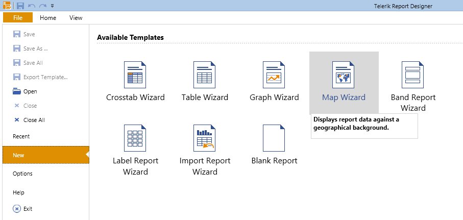
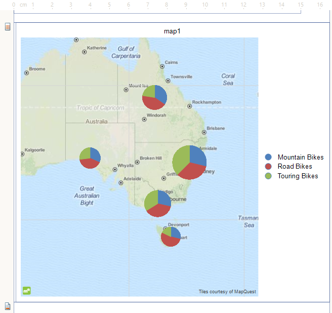

# How to Setup a Map Using the Map Wizard

In this how-to article we will show you how to create a Map which will present the sales distribution by products among several states
        using the __Adventure Works__ sample database and the [Standalone Report Designer]().
      

>important This article assumes that you have obtained a valid  __Location Provider key__  to authenticate your geocoding requests.          If you don't want to use a location provider, you need to provide the geographical coordinates of your points yourself and setup the MapSeries accordingly.          For more information please take a look at the [Location Providers]() article.        

Start the Map Wizard:

* If you create a new report, select the __Map Wizard__ icon from the __Available Templates__ page.
                

* If you want to add the Map item to an existing report, you have to select the __Map__ item
                  from the __Insert__ menu.
                  This will bring up the __Map Wizard__ which will guide you through the creation process.
                

On the __Choose Data Source__ page, add new
              __[SqlDataSource]()__:
            

* Set the connection string to the demo AdventureWorks database.

* Paste the following query in the *Select Statement* box:
                

	
                  SELECT
                  PS.Name AS ProductSubCategory,
                  SP.Name + ', ' + CR.Name AS State,
                  SOD.LineTotal as LineTotal
                  FROM

                  Production.Product AS P
                  INNER JOIN Production.ProductSubcategory AS PS ON P.ProductSubcategoryID = PS.ProductSubcategoryID
                  INNER JOIN Production.ProductCategory AS PC ON PS.ProductCategoryID = PC.ProductCategoryID
                  INNER JOIN Sales.SalesOrderDetail AS SOD ON P.ProductID = SOD.ProductID
                  INNER JOIN Sales.SalesOrderHeader AS SOH ON SOD.SalesOrderID = SOH.SalesOrderID
                  INNER JOIN Person.Address AS ADDR ON ADDR.AddressID = SOH.ShipToAddressID
                  INNER JOIN Person.StateProvince AS SP ON SP.StateProvinceID = ADDR.StateProvinceID
                  INNER JOIN Person.CountryRegion AS CR ON CR.CountryRegionCode = SP.CountryRegionCode

                  WHERE
                  CR.Name IN ('Australia')
                  AND DATEPART(YEAR, SOH.OrderDate) IN (2003, 2004)
                  AND PC.Name = 'Bikes'
                

* You can click on __Execute Query...__ just to check if everything is OK with the database connection.
                  Click __Finish__ when you are ready.
                

In the *Available data sources* list you should see the datasource you've already created.
              Select it and click __Next__.
            

In the next page you have to select the fields which will be used to build the map charts.
            

>note Since the map will use a Location Provider, there is no need to provide the  __Latitude__  and  __Longitude__  coordinates by yourself, so you can                left these boxes empty and just define a location group, which will set the geocoding string.              

* Select the __Pie Chart__ radiobutton from the *Datapoints type* box.
                

* Select the __ProductSubCategory__ field and drag it to the *Series (color)* box.
                

* Select the __State__ field and drag it to *Categories (location)* box.
                

* Select the __LineTotal__ field and drag it to *Size* box, where it will be transformed to
                __Sum(LineTotal)__

Your __Arrange map fields__ page should look like the one shown below:
            

Once the mandatory fields are set up, the __Next__ button will get enabled and you can go to the next page.
            

On the __Choose a location provider__ page you have to select the location provider that will be used to geocode
              the __State__ field that was dragged in the *Categories (location)* box on the previous page.
              Currently the supported providers are
              T:Telerik.Reporting.MapQuestOpenAPILocationProvider
              ,
              T:Telerik.Reporting.MapQuestLocationProvider
              and
              T:Telerik.Reporting.BingLocationProvider.
              They both require a valid client token (key) to authenticate the geocoding requests that will be sent from the Map item.
              Once you have obtained the key, you should paste it in the *Client token* box, as shown below:
            

When you click __Finish__, the Wizard will create the definition of the Map item, show it in the designer
              and will start to request the geocode and tiles information from the providers asynchronously. Initially it will take a few seconds to fetch
              all the data from the geocoding service, but the following requests should be executed faster. The tiles, needed to prepare the map background,
              will be displayed as they arrive, but the map will stay responsive and you can examine and change its definition.
              When finished, your map should look like this:
            

In this example we demonstrated how to setup a Map item from scratch, how to add PieChart series to it and how to initialize and
          use the __Location Provider__. All the described steps are valid for both
          [Standalone Report Designer]()
          and [Visual Studio Report Designer]() and
          can be reproduced with code as well.
        

 * [Map Overview]()

 * [Map Structure]()

 * [Location Providers]()
