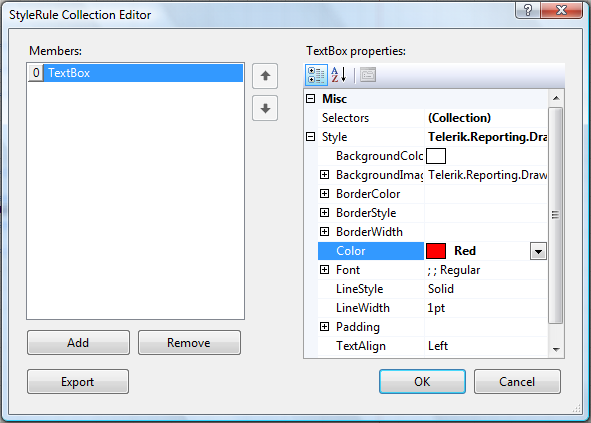
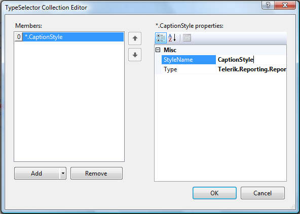
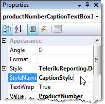

# Creating Style Rules


Style definitions can be stored in a Style Rule. Style Rules can be created in the designer or in code.


Style Rules are defined as one of the following four types:


* A 
__TypeSelector
__ applies to all report items of a particular type. 


* An 
__AttributeSelector
__ applies to all report items with a particular attribute (such as Color=Red). 


* A 
__StyleSelector
__ applies to all report items with a particular style name. 


* A 
__DescendantSelector
__ applies to all report items descended from another report item, which in turn can be specified by any type of selector.


See 
[Understanding Style Selectors]()
 for more information about the types of Style Rules.


## Creating Rules Using the StyleRule Collection Editor

1. Open the report in design view. 


1. Select the Report object. 


1. Click in the 
__StyleSheet
__ property, and then click the ellipsis button to open the StyleRule Collection Editor.


## Creating a TypeSelector StyleRule

## Using the StyleRule Collection Editor

1. In the StyleRule Collection Editor, click 
__Add
__. A new rule will be added to the Members list and you will see the Selectors and Style properties for the rule.
        
  
  

1. Click the 
__Selectors
__ property, then click the ellipsis button that appears to the right of 
__(Collection)
__. This action will open TypeSelector Collection Editor.  


1. Click the drop-down arrow on the 
__Add
__ button to choose the type of Selector to create. 


1. Click 
__TypeSelector
__ from the list. Note: TypeSelector is the default type created when you click the 
__Add
__ button.
        
  
  

1.  Click the 
__Type
__ property of the new TypeSelector, and then click the ellipsis button.
        
  
  

1. Select the 
__Telerik.Reporting.TextBox
__ and click 
__OK
__. The StyleRule will now apply to all 
__TextBox
__ report items on the report. 


1. Click the plus sign next to 
__Style
__ to expand the 
__Style
__ properties. 


1. Modify any properties you wish to define formatting to be applied to the 
__TextBox
__ report item. 


1. Click 
__OK
__ to save the rules and close the editor window.


  
  

## Creating a TypeSelector StyleRule in Code

The following code demonstrates the four steps required to create a 
__TypeSelector
____StyleRule
__ programmatically:


1. Create a new 
__StyleRule
__ called 
__MyStyleRule
__. 


1. Add a 
__TypeSelector
__ to the 
__StyleRule
__ and define the type as 
__Telerik.Reporting.TextBox
__. 


1. Apply some formatting rules to the 
__StyleRule
__. 


1. Add the 
__StyleRule
__ to the 
__Style Sheet
__.


	
````C#
		//Create a StyleRule
		Telerik.Reporting.Drawing.StyleRule myStyleRule = new Telerik.Reporting.Drawing.StyleRule();
		//Add a TypeSelector
		myStyleRule.Selectors.AddRange(new Telerik.Reporting.Drawing.ISelector[] 
		    {new Telerik.Reporting.Drawing.TypeSelector(typeof(Telerik.Reporting.TextBox))});
		//Add formatting
		myStyleRule.Style.BackgroundColor = System.Drawing.Color.Linen;
		myStyleRule.Style.Color = System.Drawing.Color.DodgerBlue;
		myStyleRule.Style.Font.Name = "Courier New";
		//Add rule to Style Sheet
		this.StyleSheet.AddRange(new Telerik.Reporting.Drawing.StyleRule[] {myStyleRule});
			
````


	
````VB.NET
		'Create a StyleRule
		Dim MyStyleRule As Telerik.Reporting.Drawing.StyleRule = New Telerik.Reporting.Drawing.StyleRule
		'Add a TypeSelector
		MyStyleRule.Selectors.AddRange(New Telerik.Reporting.Drawing.ISelector() _ 
		{New Telerik.Reporting.Drawing.TypeSelector(GetType(Telerik.Reporting.TextBox))})
		'Add formatting
		MyStyleRule.Style.BackgroundColor = System.Drawing.Color.LinenMyStyleRule.Style.Color = System.Drawing.Color.DodgerBlue
		MyStyleRule.Style.Font.Name = "Courier New"
		'Add rule to Style Sheet
		Me.StyleSheet.AddRange(New Telerik.Reporting.Drawing.StyleRule() {MyStyleRule})
			
````


## Creating a StyleSelector StyleRule

## Using the StyleRule Collection Editor

1. In the StyleRule Collection Editor, click 
__Add
__. A new rule will be added to the Members list and you will see the 
__Selectors
__ and 
__Style
__ properties for the rule. 


1. Click the 
__Selectors
__ property, and then click the ellipsis button to open the TypeSelector Collection Editor window. 


1. Click the drop-down arrow on the 
__Add
__ button to choose the type of Selector to create. 


1. Click 
__StyleSelector
__ from the list. 


1. Type a name for the Style into the 
__StyleName
__ property.
        
  
  

1. Click 
__OK
__ to return to the StyleRule Collection Editor. 


1. Expand the 
__Style
__ property and modify the formatting properties as desired. 


1. When finished, click 
__OK
__ to close the StyleRule Collection Editor.


## Creating a StyleSelector StyleRule in Code

The following code demonstrates the four steps required to create a 
__StyleSelector
____StyleRule
__ programmatically:


1. Create a new 
__StyleRule
__ called 
__MyStyleRule
__. 


1. Add a 
__TypeSelector
__ to the 
__StyleRule
__ and give it a 
__StyleName
__, such as CaptionStyle. 


1. Apply some formatting rules to the 
__StyleRule
__. 


1. Add the 
__StyleRule
__ to the 
__Style Sheet
__. 


	
````C#
		//Create a StyleRule
		Telerik.Reporting.Drawing.StyleRule myStyleRule = new Telerik.Reporting.Drawing.StyleRule();     
		//Add a StyleSelector
		myStyleRule.Selectors.AddRange(new Telerik.Reporting.Drawing.ISelector[] {new Telerik.Reporting.Drawing.StyleSelector("CaptionStyle")});
		//Add formatting
		myStyleRule.Style.BackgroundColor = System.Drawing.Color.Linen;
		myStyleRule.Style.Color = System.Drawing.Color.DodgerBlue;
		myStyleRule.Style.Font.Name = "Courier New";
		//Add rule to Style Sheet
		this.StyleSheet.AddRange(new Telerik.Reporting.Drawing.StyleRule[] {myStyleRule});
			
````


	
````VB.NET
		'Create a StyleRule
		Dim MyStyleRule As Telerik.Reporting.Drawing.StyleRule = New Telerik.Reporting.Drawing.StyleRule 
		'Add a StyleSelector
		MyStyleRule.Selectors.AddRange(New Telerik.Reporting.Drawing.ISelector() _
		{New Telerik.Reporting.Drawing.StyleSelector("CaptionStyle")})
		'Add(formatting)
		MyStyleRule.Style.BackgroundColor = System.Drawing.Color.Linen
		MyStyleRule.Style.Color = System.Drawing.Color.DodgerBlue
		MyStyleRule.Style.Font.Name = "Courier New"                   
		                    
		'Add rule to Style Sheet
		Me.StyleSheet.AddRange(New Telerik.Reporting.Drawing.StyleRule() {MyStyleRule}) 
			
````


## Applying StyleSelector StyleRules

Each report item has a 
__StyleName
__ property.


Type the 
__StyleName
__ of the desired 
__StyleRule
__ into the report item's 
__StyleName
__ property to apply the formatting of the 
__StyleRule
__.


  
    


## Creating a DescendantSelector StyleRule

## Using the StyleRule Collection Editor

1. In the StyleRule Collection Editor, click 
__Add
__. A new rule will be added to the Members list and you will see the 
__Selectors
__ and 
__Style
__ properties for the rule. 


1. Click the 
__Selectors
__ property, and then click the ellipsis button to open the TypeSelector Collection Editor window. 


1. Click the drop-down arrow on the 
__Add
__ button to choose the type of Selector to create. 


1. Click 
__DescendantSelector
__ from the list.
        
  
  The 
__DescendantSelector
__ is made up of additional 
__Selectors
__.


1. Click the 
__Selectors
__ property, and then click the ellipsis button to open up a new TypeSelector Collection Editor window.
        
  
  In this new TypeSelector Collection Editor window, you will define the Selectors that make up the DescendantSelector.


1. Click 
__Add
__ to add a new 
__TypeSelector
__. 


1. Click 
__Type
__, and then click the ellipsis button to open up the Select Type dialog. 


1. Select the 
__Telerik.Reporting.DetailSection
__ type. 


1. Add another new 
__TypeSelector
__ and set its type to 
__Telerik.Reporting.TextBox
__.
        
  
  

1. Click 
__OK
__ to close the window and return to the TypeSelector Collection Editor window for the DescendantSelector. 


1. Click 
__OK
__ to close this window and return to the StyleRule Collection Editor window.
        
  
  

1. Expand the 
__Style
__ property to define the formatting for the 
__DetailSection TextBox StyleRule
__. 


1. Click 
__OK
__ when complete.


## Creating a DescendantSelector StyleRule in Code

The following code demonstrates the four steps required to create a 
__DescendantSelector
____StyleRule
__ programmatically:


1. Create a new 
__StyleRule
__ called 
__MyStyleRule
__. 


1. Create a new 
__DescendantSelector
__. 


1. Add 
__Selectors
__ to the 
__DescendantSelectors
__. If you are using 
__TypeSelectors
__, define the types too. 


1. Add a 
__TypeSelector
__ to the 
__StyleRule
__ and give it a 
__StyleName
__, such as CaptionStyle. 


1. Apply some formatting rules to the 
__StyleRule
__. 


1. Add the 
__StyleRule
__ to the 
__Style Sheet
__. 


	
````C#
		//Create StyleRule and DescendantSelector
		Telerik.Reporting.Drawing.StyleRule myStyleRule = new Telerik.Reporting.Drawing.StyleRule();    
		Telerik.Reporting.Drawing.DescendantSelector myDescendantSelector = new Telerik.Reporting.Drawing.DescendantSelector();
		//Define the Selectors and Types of the DescendantSelector
		myDescendantSelector.Selectors.AddRange(
			new Telerik.Reporting.Drawing.ISelector[] 
			{ new Telerik.Reporting.Drawing.TypeSelector(typeof(Telerik.Reporting.ReportHeaderSection)), 
				new Telerik.Reporting.Drawing.TypeSelector(typeof(Telerik.Reporting.TextBox))
			});
		//Add the DescendantSelector to the StyleRule
		myStyleRule.Selectors.AddRange(
			new Telerik.Reporting.Drawing.ISelector[] 
			{ 
			myDescendantSelector
			});
		//Apply Formatting
		myStyleRule.Style.BorderStyle.Default = Telerik.Reporting.Drawing.BorderType.Ridge;
		myStyleRule.Style.Color = System.Drawing.Color.Navy;
		myStyleRule.Style.Font.Name = "Arial";
		//Add rule to Style Sheet
		this.StyleSheet.AddRange(new Telerik.Reporting.Drawing.StyleRule[] {myStyleRule});
			
````


	
````VB.NET
		'Create StyleRule and DescendantSelector
		Dim MyStyleRule As Telerik.Reporting.Drawing.StyleRule = New Telerik.Reporting.Drawing.StyleRule
		Dim MyDescendantSelector As Telerik.Reporting.Drawing.DescendantSelector = _ 
		New Telerik.Reporting.Drawing.DescendantSelector
		'Define the Selectors and Types of the DescendantSelector
		MyDescendantSelector.Selectors.AddRange(New Telerik.Reporting.Drawing.ISelector() _ 
		{New Telerik.Reporting.Drawing.TypeSelector(GetType(Telerik.Reporting.ReportHeaderSection)), _  
		New Telerik.Reporting.Drawing.TypeSelector(GetType(Telerik.Reporting.TextBox))})
		'Add the DescendantSelector to the StyleRule
		MyStyleRule.Selectors.AddRange(New Telerik.Reporting.Drawing.ISelector() {DescendantSelector1})
		'Apply formatting
		MyStyleRule.Style.BorderStyle.Default = Telerik.Reporting.Drawing.BorderType.Ridge
		MyStyleRule.Style.Color = System.Drawing.Color.Navy
		MyStyleRule.Style.Font.Name = "Arial"
		'Add the StyleRule to the Style Sheet
		Me.StyleSheet.AddRange(New Telerik.Reporting.Drawing.StyleRule() {MyStyleRule})
			
````


