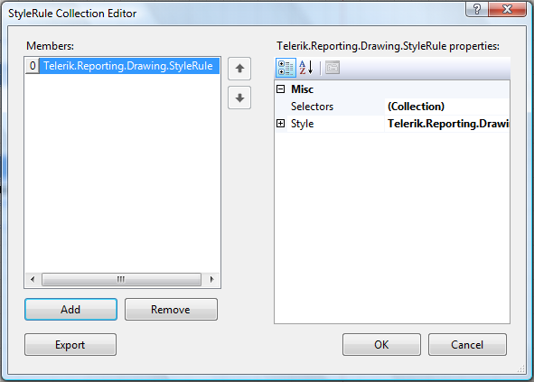
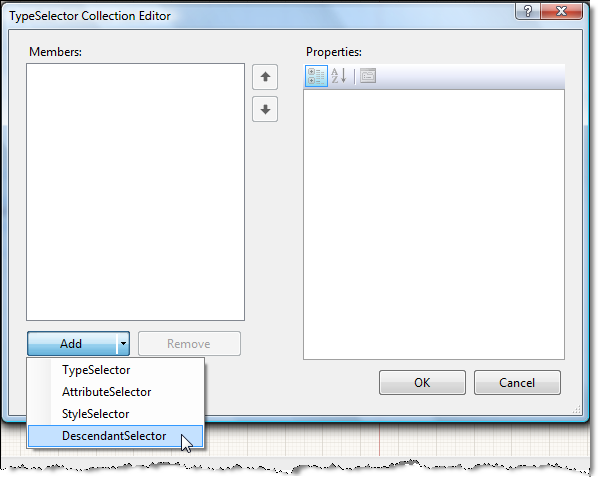
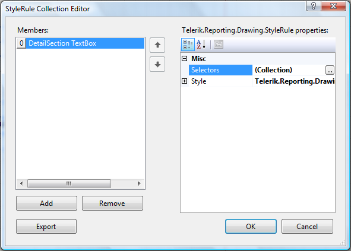

# Creating Style Rules


Style definitions can be stored in a Style Rule. Style Rules can be created in the designer or in code.

Style Rules are defined as one of the following four types:

* A__TypeSelector__applies to all report items of a particular type.

* An__AttributeSelector__applies to all report items with a particular attribute (such as Color=Red).

* A__StyleSelector__applies to all report items with a particular style name.

* A__DescendantSelector__applies to all report items descended from another report item, which in turn can be specified by any type of selector.

See [Understanding Style Selectors]() for more information about the types of Style Rules.

## Creating Rules Using the StyleRule Collection Editor

1. Open the report in design view.

1. Select the Report object.

1. Click in the__StyleSheet__property, and then click the ellipsis button to open the StyleRule Collection Editor.

## Creating a TypeSelector StyleRule

## Using the StyleRule Collection Editor

1. In the StyleRule Collection Editor, click__Add__. A new rule will be added to the Members list and you will see the Selectors and Style properties for the rule.  

  

1. Click the__Selectors__property, then click the ellipsis button that appears to the right of__(Collection)__. This action will open TypeSelector Collection Editor.

1. Click the drop-down arrow on the__Add__button to choose the type of Selector to create.

1. Click__TypeSelector__from the list. Note: TypeSelector is the default type created when you click the__Add__button.  

  

1. Click the__Type__property of the new TypeSelector, and then click the ellipsis button.  

  

1. Select the__Telerik.Reporting.TextBox__and click__OK__. The StyleRule will now apply to all__TextBox__report items on the report.

1. Click the plus sign next to__Style__to expand the__Style__properties.

1. Modify any properties you wish to define formatting to be applied to the__TextBox__report item.

1. Click__OK__to save the rules and close the editor window.

  

  

## Creating a TypeSelector StyleRule in Code

The following code demonstrates the four steps required to create a __TypeSelector____StyleRule__ programmatically:

1. Create a new__StyleRule__called__MyStyleRule__.

1. Add a__TypeSelector__to the__StyleRule__and define the type as__Telerik.Reporting.TextBox__.

1. Apply some formatting rules to the__StyleRule__.

1. Add the__StyleRule__to the__Style Sheet__.

	
````C#
		//Create a StyleRule
		Telerik.Reporting.Drawing.StyleRule myStyleRule = new Telerik.Reporting.Drawing.StyleRule();
		//Add a TypeSelector
		myStyleRule.Selectors.AddRange(new Telerik.Reporting.Drawing.ISelector[] 
		    {new Telerik.Reporting.Drawing.TypeSelector(typeof(Telerik.Reporting.TextBox))});
		//Add formatting
		myStyleRule.Style.BackgroundColor = System.Drawing.Color.Linen;
		myStyleRule.Style.Color = System.Drawing.Color.DodgerBlue;
		myStyleRule.Style.Font.Name = "Courier New";
		//Add rule to Style Sheet
		this.StyleSheet.AddRange(new Telerik.Reporting.Drawing.StyleRule[] {myStyleRule});
````


	
````VB.NET
		'Create a StyleRule
		Dim MyStyleRule As Telerik.Reporting.Drawing.StyleRule = New Telerik.Reporting.Drawing.StyleRule
		'Add a TypeSelector
		MyStyleRule.Selectors.AddRange(New Telerik.Reporting.Drawing.ISelector() _ 
		{New Telerik.Reporting.Drawing.TypeSelector(GetType(Telerik.Reporting.TextBox))})
		'Add formatting
		MyStyleRule.Style.BackgroundColor = System.Drawing.Color.LinenMyStyleRule.Style.Color = System.Drawing.Color.DodgerBlue
		MyStyleRule.Style.Font.Name = "Courier New"
		'Add rule to Style Sheet
		Me.StyleSheet.AddRange(New Telerik.Reporting.Drawing.StyleRule() {MyStyleRule})
````


## Creating a StyleSelector StyleRule

## Using the StyleRule Collection Editor

1. In the StyleRule Collection Editor, click__Add__. A new rule will be added to the Members list and you will see the__Selectors__and__Style__properties for the rule.

1. Click the__Selectors__property, and then click the ellipsis button to open the TypeSelector Collection Editor window.

1. Click the drop-down arrow on the__Add__button to choose the type of Selector to create.

1. Click__StyleSelector__from the list.

1. Type a name for the Style into the__StyleName__property.  

  

1. Click__OK__to return to the StyleRule Collection Editor.

1. Expand the__Style__property and modify the formatting properties as desired.

1. When finished, click__OK__to close the StyleRule Collection Editor.

## Creating a StyleSelector StyleRule in Code

The following code demonstrates the four steps required to create a __StyleSelector____StyleRule__ programmatically:

1. Create a new__StyleRule__called__MyStyleRule__.

1. Add a__TypeSelector__to the__StyleRule__and give it a__StyleName__, such as CaptionStyle.

1. Apply some formatting rules to the__StyleRule__.

1. Add the__StyleRule__to the__Style Sheet__.

	
````C#
		//Create a StyleRule
		Telerik.Reporting.Drawing.StyleRule myStyleRule = new Telerik.Reporting.Drawing.StyleRule();     
		//Add a StyleSelector
		myStyleRule.Selectors.AddRange(new Telerik.Reporting.Drawing.ISelector[] {new Telerik.Reporting.Drawing.StyleSelector("CaptionStyle")});
		//Add formatting
		myStyleRule.Style.BackgroundColor = System.Drawing.Color.Linen;
		myStyleRule.Style.Color = System.Drawing.Color.DodgerBlue;
		myStyleRule.Style.Font.Name = "Courier New";
		//Add rule to Style Sheet
		this.StyleSheet.AddRange(new Telerik.Reporting.Drawing.StyleRule[] {myStyleRule});
````


	
````VB.NET
		'Create a StyleRule
		Dim MyStyleRule As Telerik.Reporting.Drawing.StyleRule = New Telerik.Reporting.Drawing.StyleRule 
		'Add a StyleSelector
		MyStyleRule.Selectors.AddRange(New Telerik.Reporting.Drawing.ISelector() _
		{New Telerik.Reporting.Drawing.StyleSelector("CaptionStyle")})
		'Add(formatting)
		MyStyleRule.Style.BackgroundColor = System.Drawing.Color.Linen
		MyStyleRule.Style.Color = System.Drawing.Color.DodgerBlue
		MyStyleRule.Style.Font.Name = "Courier New"                   
		'Add rule to Style Sheet
		Me.StyleSheet.AddRange(New Telerik.Reporting.Drawing.StyleRule() {MyStyleRule})
````


## Applying StyleSelector StyleRules

Each report item has a __StyleName__ property.

Type the __StyleName__ of the desired __StyleRule__ into the report item's __StyleName__ property to apply the formatting of the __StyleRule__.

  

    

## Creating a DescendantSelector StyleRule

## Using the StyleRule Collection Editor

1. In the StyleRule Collection Editor, click__Add__. A new rule will be added to the Members list and you will see the__Selectors__and__Style__properties for the rule.

1. Click the__Selectors__property, and then click the ellipsis button to open the TypeSelector Collection Editor window.

1. Click the drop-down arrow on the__Add__button to choose the type of Selector to create.

1. Click__DescendantSelector__from the list.  

  The __DescendantSelector__ is made up of additional __Selectors__.

1. Click the__Selectors__property, and then click the ellipsis button to open up a new TypeSelector Collection Editor window.  

  In this new TypeSelector Collection Editor window, you will define the Selectors that make up the DescendantSelector.

1. Click__Add__to add a new__TypeSelector__.

1. Click__Type__, and then click the ellipsis button to open up the Select Type dialog.

1. Select the__Telerik.Reporting.DetailSection__type.

1. Add another new__TypeSelector__and set its type to__Telerik.Reporting.TextBox__.  

  

1. Click__OK__to close the window and return to the TypeSelector Collection Editor window for the DescendantSelector.

1. Click__OK__to close this window and return to the StyleRule Collection Editor window.  

  

1. Expand the__Style__property to define the formatting for the__DetailSection TextBox StyleRule__.

1. Click__OK__when complete.

## Creating a DescendantSelector StyleRule in Code

The following code demonstrates the four steps required to create a __DescendantSelector____StyleRule__ programmatically:

1. Create a new__StyleRule__called__MyStyleRule__.

1. Create a new__DescendantSelector__.

1. Add__Selectors__to the__DescendantSelectors__. If you are using__TypeSelectors__, define the types too.

1. Add a__TypeSelector__to the__StyleRule__and give it a__StyleName__, such as CaptionStyle.

1. Apply some formatting rules to the__StyleRule__.

1. Add the__StyleRule__to the__Style Sheet__.

	
````C#
		//Create StyleRule and DescendantSelector
		Telerik.Reporting.Drawing.StyleRule myStyleRule = new Telerik.Reporting.Drawing.StyleRule();    
		Telerik.Reporting.Drawing.DescendantSelector myDescendantSelector = new Telerik.Reporting.Drawing.DescendantSelector();
		//Define the Selectors and Types of the DescendantSelector
		myDescendantSelector.Selectors.AddRange(
			new Telerik.Reporting.Drawing.ISelector[] 
			{ new Telerik.Reporting.Drawing.TypeSelector(typeof(Telerik.Reporting.ReportHeaderSection)), 
				new Telerik.Reporting.Drawing.TypeSelector(typeof(Telerik.Reporting.TextBox))
			});
		//Add the DescendantSelector to the StyleRule
		myStyleRule.Selectors.AddRange(
			new Telerik.Reporting.Drawing.ISelector[] 
			{ 
			myDescendantSelector
			});
		//Apply Formatting
		myStyleRule.Style.BorderStyle.Default = Telerik.Reporting.Drawing.BorderType.Ridge;
		myStyleRule.Style.Color = System.Drawing.Color.Navy;
		myStyleRule.Style.Font.Name = "Arial";
		//Add rule to Style Sheet
		this.StyleSheet.AddRange(new Telerik.Reporting.Drawing.StyleRule[] {myStyleRule});
````


	
````VB.NET
		'Create StyleRule and DescendantSelector
		Dim MyStyleRule As Telerik.Reporting.Drawing.StyleRule = New Telerik.Reporting.Drawing.StyleRule
		Dim MyDescendantSelector As Telerik.Reporting.Drawing.DescendantSelector = _ 
		New Telerik.Reporting.Drawing.DescendantSelector
		'Define the Selectors and Types of the DescendantSelector
		MyDescendantSelector.Selectors.AddRange(New Telerik.Reporting.Drawing.ISelector() _ 
		{New Telerik.Reporting.Drawing.TypeSelector(GetType(Telerik.Reporting.ReportHeaderSection)), _  
		New Telerik.Reporting.Drawing.TypeSelector(GetType(Telerik.Reporting.TextBox))})
		'Add the DescendantSelector to the StyleRule
		MyStyleRule.Selectors.AddRange(New Telerik.Reporting.Drawing.ISelector() {DescendantSelector1})
		'Apply formatting
		MyStyleRule.Style.BorderStyle.Default = Telerik.Reporting.Drawing.BorderType.Ridge
		MyStyleRule.Style.Color = System.Drawing.Color.Navy
		MyStyleRule.Style.Font.Name = "Arial"
		'Add the StyleRule to the Style Sheet
		Me.StyleSheet.AddRange(New Telerik.Reporting.Drawing.StyleRule() {MyStyleRule})
````


