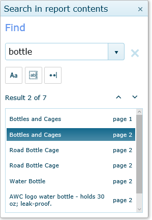

# Search

HTML5-based report viewers provides the capability to search in report contents. The search process uses metadata,         gathered during the report processing. The metadata entries are added per each textual report item and contain text contents and physical bounds, which determine         the highlighted areas of the currently found and selected search items. The metadata text contents are used by the search dialog to perform the actual search.       

## Controlling Search Behavior

The behavior of the search dialog depends on the __searchMetadataOnDemand__ property.           Its default value is __false__, which means that by default the processing engine will include search metadata in the rendering result of every           report processing. As a result, the search dialog will be able to perform a search in report contents immediately.           This metadata is stored in the memory, so for a very huge reports it could cause a performance drawback.         

If the __searchMetadataOnDemand__ property is set to           __true__, the processing engine will not include the search metadata in the rendering result set. This metadata will be fetched "on demand",           which will occur when the search dialog is shown. In this case the currently loaded in the viewer report will be processed once again to obtain the metadata and pass it           to the search dialog.         

## Search dialog  
  

The search dialog is a Kendo Window Widget, that stays on top of the report viewer. Since it's not modal, the viewer remains fully functional even when the search dialog is shown.           The dialog can be closed with the close button in the top right corner or using the __search__ button on the toolbar.         

The dialog consists of the following components:         

* __Search combobox__ - used to enter the search token. The search process is triggered on every keystroke, but its actual start is delayed by one second after the last keystroke.             

* __Stop button__ - stops currently running search. The button is enabled only when a search is already started and disables when the search is completed.             

* __Match case button__ - this toggle button sets a search criteria that requires to match the casing of the search token and provided metadata.             

* __Match whole word__ - this toggle button sets a criteria that searches the metadata for a whole word, equal to the provided search token.             

* __Use regular expressions__ - this toggle button allows to perform a search using the regular expression rules in search combobox.               In case the entered regular expression is incorrect, a warning red icon next to the button will appear and the exception message will be set as its tooltip.             

* __Results list__ - a list that displays the found results and allows navigating through them.               Every match of the metadata entries against the token is displayed on a separate row. If the token is found more than once in a metadata entry, every match will be shown as a new row.               The data grid row shows a small excerpt from the metadata text and the page on which the result is found.             

* __Navigation buttons__ - these buttons are used to change the currently selected row. The selection can also be changed with the arrow keys.             

The dialog relies on search metadata, which is obtained from every rendering result. Along with the textual content and physical bounds of a textual item,           every metadata entry contains also the page number where the item is positioned. Even consecutive renderings of a same report could produce a different number of pages,           so when the user navigates to another report, refreshes the current report or changes the report viewer's view mode, the search dialog closes and needs to be opened again.         

## Important Notes

The complex data items like Graph and Map provide metadata for each data point label, axis label, title and legend, but since these complex items are rendered           in one SVG container, they will be entirely highlighted even when the search token matches any of their composite parts.         
