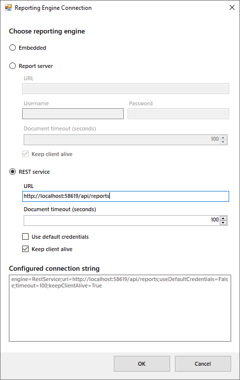

# How to Use Windows Forms Report Viewer With REST Service

This topic explains how to setup the Windows Forms Report Viewer to work with Telerik Reporting REST Service

## Prerequisites

* Running               [ Telerik Reporting REST Service ]() instance.             

* In case you are not using [Item Templates ](),               add references to all the assemblies listed                [here]().             

## Configuring the Windows Forms Report Viewer to work with REST Service

###

1. To create a form and host the report viewer in it, you can either use the item template, as explained                   [here](), or place it yourself through drag-and-drop from the toolbox.                 

1. As soon as the report viewer is on your form, select it and locate the __ReportEngineConnection__  property.                   invoke the UI editor by pressing the ellipsis button. The Report Engine Connection Editor dialog should appear:                   

  

1. The __Reporting engine__  combobox provides the following options:                 
   + *Embedded*  - the reports will be processed and rendered at the local machine that hosts the viewer. This is the default mode in order to preserve backwards compatibility.                     

   + *REST Service*  - the reports will be processed at the machine that hosts configured and running REST Service instance.                     

   + *Report Server*  - the reports will be processed and rendered at the machine that hosts configured and running                        [Telerik Report Server ](http://docs.telerik.com/report-server/introduction)  instance.                     
    Select *REST Service* .                 

1. In __URL__  textbox enter the address and port (if needed) of the machine that hosts the REST Service instance.                   Note that the */api/reports*  part is already added so you need to prefix it with the service address.                 

1. Check the __Use default credentials__  checkbox if you need the default credentials to be sent with the requests by the                    [HTTP client handler ](https://msdn.microsoft.com/query/dev14.query?appId=Dev14IDEF1&l&EN-US&k=k(System.Net.Http.HttpClientHandler.UseDefaultCredentials))                    that is used internally to communicate with the REST service.                 

1. In the __Document timeout__  textbox you can change the timeout for rendering a document, the default is 100 seconds.                 

1. Uncheck the __Keep client alive__  checkbox if you want the client session to expire.                 

1. Click __OK__  when ready. The dialog will close and the resulting connection string will be populated as a value of the __ReportEngineConnection__  property.                 

1. Locate the __ReportSource__  property. Invoke the UI editor by pressing the ellipsis button. The Report Source Editor dialog should appear:                   

  

    >tip When the                      [ReportEngineConnection](/reporting/api/Telerik.ReportViewer.WinForms.ReportViewerBase#Telerik_ReportViewer_WinForms_ReportViewerBase_ReportEngineConnection)                      property has  __Engine__  set to  *RestService* ,                     the viewer will serialize the report source identifier property                     ( __URI__  for                      [UriReportSource](/reporting/api/Telerik.Reporting.UriReportSource) ,                      __TypeName__  for                      [TypeReportSource](/reporting/api/Telerik.Reporting.TypeReportSource) ,                      __ReportDocument__  for                      [InstanceReportSource](/reporting/api/Telerik.Reporting.InstanceReportSource)  and                      __XML__  for                      [XmlReportSource](/reporting/api/Telerik.Reporting.XmlReportSource) ) and send it to the service resolver.                   The  *REST service*  will use the  __ReportResolver__  instances included in its                      [ReportServiceConfiguration](/reporting/api/Telerik.Reporting.Service.ReportServiceConfiguration)  to resolve the report by the provided identifier.                     However, the  *REST service* 's default implementation includes only                      [ReportFileResolver](/reporting/api/Telerik.Reporting.Service.ReportFileResolver)  and                      [ReportTypeResolver](/reporting/api/Telerik.Reporting.Service.ReportTypeResolver) ,                     so you need to provide a                     [Custom Report Source Resolver]() if you use another type of                      [ReportSource](/reporting/api/Telerik.Reporting.ReportSource) .                   

1. In this scenario we will use a  [UriReportSource](/reporting/api/Telerik.Reporting.UriReportSource) .                   Select the __URL or file__  radio button. Enter the path and the name of the report you want to display.                     If needed, you can setup the report source parameters using the dialog, invoked by pressing the __Edit Parameters__  button.                 

1. Click __OK__  when ready. The dialog will close and the resulting report source will be populated as a value of the __ReportSource__  property.                 

1. Build and run your application. If your settings are configured correctly, you should see the report displayed in the report viewer of your WinForms application.                   If not, check the                   [Troubleshooting](#Troubleshooting) section below.                 

## Troubleshooting

The following table shows the most common reasons for failure when using the Telerik Reporting REST Service. It is strongly recommended to use a tool like           Fiddler or any other web debugger when investigating such a problem.         

| Problem | Cause |
| ------ | ------ |
|The viewer displays the message:`A problem occurred while registering client.`|Check if the REST service is active and running - the easiest way is to make a request for the available document formats, as explained[ here ]().|
|The viewer displays the message:`System.OperationCanceledException: *{ReportName}* report cannot be resolved.`|Make sure the URL or type name specified in the __report source__ property is valid and can be resolved by the REST service.|
|The viewer displays the message:`System.Net.WebException: The remote name could not be resolved: {name}`|Make sure that the address specified in the connection string exists and represents a valid and running REST service instance|

# See Also

 * [How to Use Windows Forms Report Viewer With Report Server]()

 * [How to Construct a string to connect to Report Engine]() * [EmbeddedConnectionInfo](/reporting/api/Telerik.ReportViewer.Common.EmbeddedConnectionInfo)  * [ReportServerConnectionInfo](/reporting/api/Telerik.ReportViewer.Common.ReportServerConnectionInfo)  * [RestServiceConnectionInfo](/reporting/api/Telerik.ReportViewer.Common.RestServiceConnectionInfo) 
