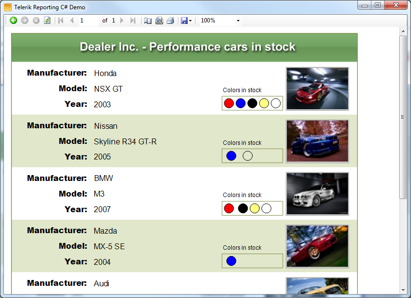

# Windows Forms Application Overview


The Windows Forms Report Viewer is designed to render Telerik __Reports__  within Windows Forms projects.         

  

## 

The toolbar on the Windows Forms Report Viewer provides basic functionality for interacting with the currently-loaded report:

* Navigate back in history

* Navigate forward in history

* Stop loading (useful when a large report is taking a long time to load)             

* Refresh

* Go to first page

* Go to previous page

* Go to a specific page

* Total number of pages

* Go to next page

* Go to last page

* Page Setup (set paper kind, orientation, margins)

* Print Preview: switches between __Logical__  and __Physical__  page renderer. See [Rendering and Paging]() for more info.             

* Print

* Export: see [Export Formats]() for available export formats.             

* Zoom level

* Show/Hide parameters area

* Show/Hide document map

>note .NET Framework  __Client Profile__  is not supported.           


## How it works

The Windows Forms ReportViewer control is a composite of standard Windows Forms controls.         

>note The Windows Forms ReportViewer control's toolbar is immutable. To build custom UI for the toolbar and work with the rendered report in the viewer,             you can use the Windows Forms  [ReportViewer](/reporting/api/Telerik.ReportViewer.WinForms.ReportViewer) .           


The purpose of the Windows Forms ReportViewer control is to display Telerik Reports and allow the user to interact with them.           Reports are processed and rendered on the client machine. The report in the viewer is rendered through Telerik Reporting IMAGE rendering mechanism based on the           [Design Considerations for Image Rendering]().         

## Declaring the application as DPI-aware

When using Windows Forms ReportViewer on a machine with Windows Vista and later operating system and DPI scale factor higher than 96, the form content           (labels, buttons, rendered report image, etc. ) might be rendered fuzzy, pixelated and with other visual artifacts.           This is because the application in which you are using the Windows Forms Report Viewer is not declared as DPI aware. The recommended approach for declaring an application           as DPI aware is adding a __dpiAware__  element to its application manifest, as shown below:         

	
````xml
          <assembly xmlns="urn:schemas-microsoft-com:asm.v1" manifestVersion="1.0" xmlns:asmv3="urn:schemas-microsoft-com:asm.v3" >
            <asmv3:application>
              <asmv3:windowsSettings xmlns="http://schemas.microsoft.com/SMI/2005/WindowsSettings">
                <dpiAware>True</dpiAware>
              </asmv3:windowsSettings>
            </asmv3:application>
          </assembly>
````


Since Windows 10 Anniversary Update, the Windows runtime has improved the UX for Windows Forms applications that are not declared as DPI-aware. Unfortunately in some cases this behavior leads to incorrect calculation of interactive item positions. We recommend always declaring the Windows Forms application as DPI-aware.         

You can read more about writing DPI-aware desktop applications            [               here.             ](               https://msdn.microsoft.com/en-us/library/windows/desktop/dn469266(v=vs.85).aspx             ) 

## Keyboard shortcuts

The following table lists the keyboard and mouse commands used in Windows Forms Report Viewer. The commands use the CTRL key as modifier that changes the applied action.         


| Mouse or key event | Action | Action with applied CTRL modifier |
| ------ | ------ | ------ |
|Mouse wheel|Scrolls up/down the document|Zooms in/out|
|Up|Scrolls the view one row up|n/a|
|Down|Scrolls the view one row down|n/a|
|Left|Scrolls the view one row left|n/a|
|Right|Scrolls the view one row right|n/a|
|Page up|Scrolls the view up|Scrolls the view to top of the current page and then to the previous page|
|Page down|Scrolls the view down|Scrolls the view to bottom of the current page and then to the next page|
|Home|Scrolls the view left|Scrolls the view to the previous page|
|End|Scrolls the view right|Scrolls the view to the next page|
|+ (Plus)|n/a|Zooms in|
|- (Minus)|n/a|Zooms out|
|F|n/a|Opens the search dialo|


## See Also


 * [How to Add report viewer to a Windows Forms' .NET Framework project]()

 * [Report Viewer Localization]()

 * [Windows Forms Application]()
