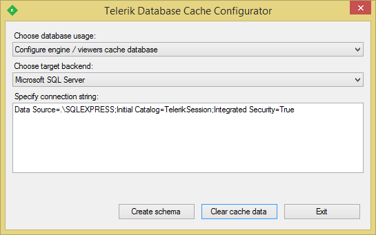

# Configuring the Database Cache Provider


>important The cache settings mentioned in this article are not obligatory, and they do not apply to the            __HTML5 Viewer__  or its Angular, WebForms and MVC wrappers. Details about the Cache Storage of the Reporting REST           Service that works with the HTML5 Viewer are available in           [Cache Management: HTML5 Report Viewer and Reporting REST services]()           and [REST Service Storage Settings]().         


The database cache provider stores the rendered pages and resources in database. This is useful in web farm         applications where different computers can serve different requests to the same report, so a common storage is necessary to hold         the shared resources.       

Before using the database cache provider it is necessary to install the shared database. Start the __           Database Cache           Configuration Tool         __ that can be found in the following location:       

-InstallDir-\Tools\DatabaseCacheConfigurator.exe

where __InstallDir__ is the installation directory of __Telerik Reporting__.         
  

Choose the desired target backend from the drop-down list and specify the connection string to the database being created in the text         block below. It is recommended that the database specified in the connection string is different from your production database. Click the         "Create schema" button to configure the database. The __Database Cache Configuration Tool__ can be used to create a new database         or reconfigure an existing one, if the database schema has changed from the previous release of __Telerik Reporting__.       

Two cache providers are available:

* __ADO.NET__ cache provider.             The following XML snippet demonstrates how to configure this provider:           

	
````xml
<Telerik.Reporting>
  <Cache provider="ADO.NET">
    <Providers>
      <Provider name="ADO.NET">
        <Parameters>
          <Parameter name="ProviderName" value="System.Data.SqlClient" />
          <Parameter name="ConnectionString" value="MyConnectionString" />
        </Parameters>
      </Provider>
    </Providers>
  </Cache>
</Telerik.Reporting>
````

Here the "ProviderName" parameter specifies the __ADO.NET__ provider, and the "ConnectionString" specifies the connection string to the database.           

* __Telerik Data Access__ cache provider.             Add the requires reference to             *Telerik.OpenAccess.dll*,             *Telerik.OpenAccess.35.Extensions.dll* and             *Telerik.OpenAccess.Runtime.dll*.             It is necessary to configure the [Telerik Reporting Configuration Section]() first and then use the following XML snippet to             configure this provider in application’s configuration file:           

	
````xml
<Telerik.Reporting>
  <Cache provider="Database">
    <Providers>
      <Provider name="Database">
        <Parameters>
          <Parameter name="BackendName" value="mssql" />
          <Parameter name="ConnectionString" value="MyConnectionString" />
        </Parameters>
      </Provider>
    </Providers>
  </Cache>
</Telerik.Reporting>
````

Here the "BackendName" parameter specifies the name of the chosen backend. Complete list of the backends is available in the             [Backend Strings and Provider Names List](http://docs.telerik.com/data-access/developers-guide/database-specifics/database-specifics-backend-strings-provider-names-list) article. The "ConnectionString" specifies the connection string to the database.             The connection string can be specified either as a named connection, configured in the "connectionStrings" section of the configuration file, or directly             as an inline connection string.           __Binding Redirects__In case you use __Telerik Data Access__ version greater than 2015.1.225.1, you have to redirect all assemblies required by the Database Cache Provider to their             latest versions. To do this, add the following bindingRedirects to your configuration file and replace the x.x.x.x with the exact version of __Telerik Data Access__ assemblies:           

	
````xml
<?xml version="1.0" encoding="utf-8" ?>
<configuration>
  <runtime>
    <assemblyBinding xmlns="urn:schemas-microsoft-com:asm.v1">
      <dependentAssembly>
        <assemblyIdentity name="Telerik.OpenAccess" culture="neutral" publicKeyToken="7ce17eeaf1d59342"/>
        <bindingRedirect oldVersion="0.0.0.0-65535.65535.65535.65535" newVersion="x.x.x.x"/>
      </dependentAssembly>
      <dependentAssembly>
        <assemblyIdentity name="Telerik.OpenAccess.35.Extensions" culture="neutral" publicKeyToken="7ce17eeaf1d59342"/>
        <bindingRedirect oldVersion="0.0.0.0-65535.65535.65535.65535" newVersion="x.x.x.x"/>
      </dependentAssembly>
      <dependentAssembly>
        <assemblyIdentity name="Telerik.OpenAccess.Runtime" culture="neutral" publicKeyToken="7ce17eeaf1d59342"/>
        <bindingRedirect oldVersion="0.0.0.0-65535.65535.65535.65535" newVersion="x.x.x.x"/>
      </dependentAssembly>
    </assemblyBinding>
  </runtime>
</configuration>
````


# See Also


 * [Configuring Cache]()

 * [Configuring the File Cache Provider]()

 * [Telerik Reporting Configuration Section]()
