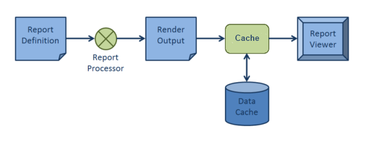
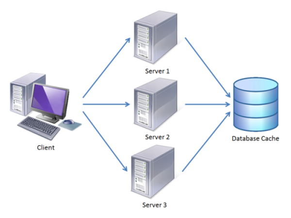

# Other ReportViewer Controls Overview

__Telerik Reporting__ uses a dedicated cache management system to store and cache
        rendered pages and some large resources such as images on an external storage. This cache management system
        is utilized by report viewers automatically as shown in the following illustration:
        
  

## Applicable For

* __WinForms ReportViewer__ - settings must be applied in the application configuration file.
              By default the viewer keeps the report state in memory;
            

* __WPF ReportViewer__ - settings must be applied in the application configuration file.
              By default the viewer keeps the report state in memory;
            

* __Silverlight ReportViewer__ - settings must be applied in the
              [Reporting WCF service]() application configuration file.
              By default the viewer keeps the report state in memory;
            

* __ASP.NET WebForms ReportViewer (obsolete web viewer)__ - settings must be applied in the application configuration file.
              By default the viewer keeps the report state in the ASP.NET Session;
            

>important The cache settings mentioned in this article are not obligatory, and they do not apply to the             __HTML5 Viewer__  or its Angular, WebForms and MVC wrappers. Details about the Cache Storage of the Reporting REST            Service that works with the HTML5 Viewer are available in            [Cache Management: HTML5 Report Viewer and Reporting REST services]().          

## 

## Cache Management

Such cache management implementation offers the following key benefits:

* __Reduced memory footprint__ – since the rendered pages and resources are cached on an external storage
              rather than being kept in memory, the viewers can handle very large reports with thousands of pages and images without increasing the
              memory consumed by the application too much.
            

* __Improved performance__ – the caching mechanism implemented by the cache management system can lead to improved
              performance of the viewers in certain scenarios.
            

* __Improved scalability__ – web farms can be configured to cache rendered reports on a dedicated database
              server. This allows subsequent requests to the same report to be served by different machines in the web farm leading to better load
              balancing. Only the database storage is shared between all machines in the farm, as shown in the following illustration:
              
  

# See Also

 * [Configuring Cache]()

 * [Configuring the File Cache Provider]()

 * [Configuring the Database Cache Provider]()

 * [Configuring Custom Cache Provider]()
